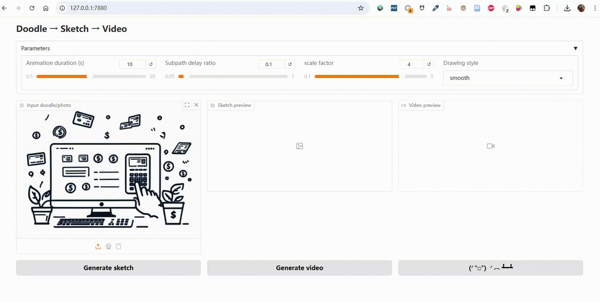

# Sketch to Motion

Convert a static image into a smooth drawing animation using [Manim](https://www.manim.community/).

This project takes a doodle, photo, or sketch, converts it into an SVG vector graphic, and renders it into an animated MP4 video with Manim.  
It also prepends the last frame to the start of the video, creating a short pause for a more polished look.

---

## Features

- **Image → Sketch → SVG → Animated MP4**
- Adjustable animation parameters:
  - **Animation duration** (seconds)
  - **Subpath delay ratio** (fractional delay between subpaths)
  - **Scale factor** (zoom in/out)
  - **Drawing style** (`linear`, `smooth`, `there_and_back`, `wiggle`)
- High-quality vector rendering powered by Manim
- Automatic last-frame prepend for a smooth intro
- Simple [Gradio](https://www.gradio.app/) web interface

---

## Installation

### 1. Clone this repository
```bash
git clone https://github.com/yourusername/sketch-to-motion.git
cd Sketch2Motion
````

### 2. Install Python dependencies

Make sure you have **Python 3.9+** installed.

```bash
pip install -r requirements.txt
```

Key dependencies:

* [Gradio](https://www.gradio.app/)
* [Manim](https://docs.manim.community/)
* [ffmpeg](https://ffmpeg.org/) (must be installed and in your PATH)

Install Manim:

[Installing Manim](https://docs.manim.community/en/stable/installation/uv.html)

Install ffmpeg:

* **Windows**: [Download from official site](https://ffmpeg.org/download.html) and add `bin` folder to PATH
* **macOS**: `brew install ffmpeg`
* **Linux**: `sudo apt install ffmpeg` or use your package manager

---

## Usage

### Launch the Gradio app

```bash
python app.py
```

Access the app at:

```
http://127.0.0.1:7880
```

### 3. Web interface workflow

1. Upload a doodle/photo as the **Input image**.
2. Click **Generate sketch** to convert it to SVG.
3. Adjust **Animation duration**, **Subpath delay ratio**, **Scale factor**, and **Drawing style**.
4. Click **Generate video** to render and preview the animation.
5. Download the generated MP4.

